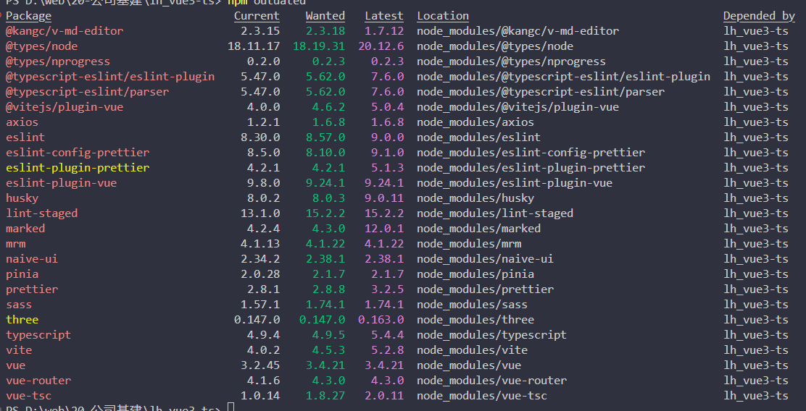
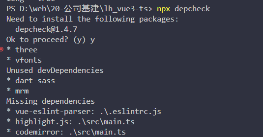

# 检索工具

## 过时依赖
```shell
npm outdated
```


默认只会检查项目 package.json 中直接引用的依赖， --all 选项可以用来匹配全部的依赖。但没有必要，真要彻底升级，更推荐尝试重建 lock 文件。

对于 outdated 的包，使用 npm update 或其他包管理工具对应的 update 命令即可安装 SemVer 标准执行升级。如果想跨越 Major 版本，则需要手动指定升级版本。

## 风险依赖

```shell
npm audit
```
注意：需要切换官方 npm 源

## 隐式依赖
```shell
npx depcheck
````
